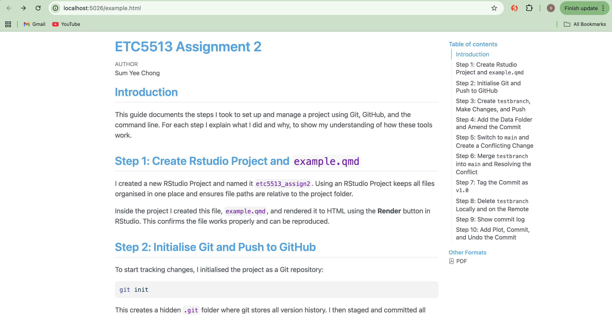
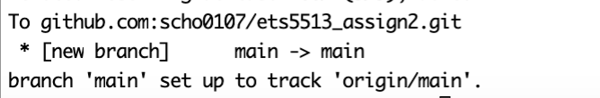
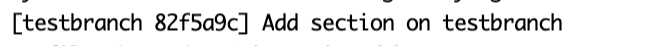
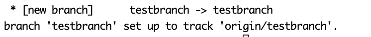
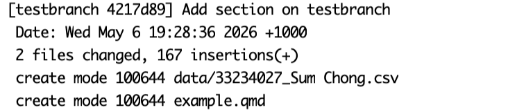
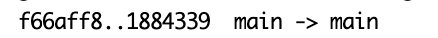
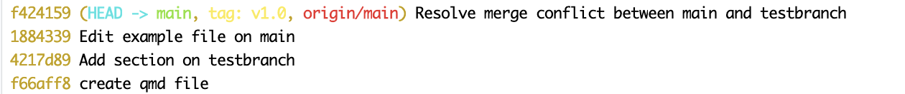
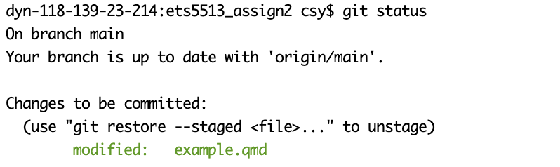

## Introduction

This guide documents the steps I took to set up and manage a project using Git, GitHub, and the command line. For each step I explain what I did and why, to show my understanding of how these tools work.

## Step 1: Create Rstudio Project and `example.qmd`

I created a new RStudio Project and named it `etc5513_assign2`. Using an RStudio Project keeps all files organised in one place and ensures file paths are relative to the project folder.

Inside the project I created this file, `example.qmd`, and rendered it to HTML using the **Render** button in RStudio. This confirms the file works properly and can be reproduced:

{width="625"}

## Step 2: Initialise Git and Push to GitHub

To start tracking changes, I initialised the project as a Git repository:

``` bash
git init
```

This creates a hidden `.git` folder where git stores all version history. I then staged and committed all files:

``` bash
git add .
git commit -m "create qmd file"
```

Output:

{width="517" height="23"}

`git add .` stages everything in the folder. `git commit` saves a snapshot with a message describing what was included.

Next, I renamed the branch to `main`, connected the repository to GitHub, and pushed:

``` bash
git branch -M main
git remote add origin git@github.com:scho0107/ets5513_assign2.git 
git push -u origin main 
```

`git branch -M main` renames the default branch to `main`. `git remote add origin` links the local repo to GitHub, and `git push -u origin main` uploads the commit and sets up tracking so future pushes work automatically.

The output confirmed that `main` was successfully pushed to GitHub and set up to track the remote branch:

{width="365"}

## Step 3: Create `testbranch`, Make Changes, and Push

Instead of working directly on `main`, I created a new branch to keep changes isolated:

``` bash
git switch -c testbranch
```

I then edited `example.qmd` by adding a new section. I first ran `git status` to check what had changed, then staged and committed only the intended file:

``` bash
git status
git add example.qmd
git commit -m "Add section on testbranch"
git push -u origin testbranch
```

The push output confirmed that `testbranch` was created on GitHub and set up to track the remote branch:

{width="370" height="26"}

{width="383"}

## Step 4: Add the Data Folder and Amend the Commit

After committing, I added a `data` folder containing the dataset from Assignment 1. I created the folder, copied the CSV file in manually, and then amended the previous commit rather than creating a separate one:

``` bash
mkdir data
git add data
git commit --amend --no-edit
```

`git commit --amend` rewrites the last commit to include the newly staged files. `--no-edit` keeps the original commit message. The output confirmed that `data/33234027_Sum Chong.csv` was included in the amended commit.

{width="313"}

Because amending changes the commit hash, a normal push would be rejected. I used `--force-with-lease` instead of `--force` because it is safer — it checks that no one else has pushed to the branch since my last pull before overwriting it.

``` bash
git push --force-with-lease origin testbranch
```

The terminal confirmed the branch was force updated:

{width="478" height="26"}

## Step 5: Switch to `main` and Create a Conflicting Change

I switched back to `main` and edited `example.qmd` in a different way to what I had done on `testbranch`, so that merging the two branches would produce a conflict:

``` bash
git switch main
git add example.qmd
git commit -m "Edit example file on main"
git push origin main
```

Output:

{width="386"}

{width="303" height="28"}

On `testbranch`, I added the following content:

``` text
# Test branch section

This section was added on testbranch.
```

On `main`, I edited the same part of the file with different content:

``` text
# Conflict section

This sentence was written on the main branch.
```

Because both branches modified the same lines differently, Git could not automatically merge them and produced a merge conflict.

## Step 6: Merge `testbranch` into `main` and Resolving the Conflict

I merged the branch:

``` bash
git switch main
git merge testbranch
```

Git detected a conflict and stopped:

{width="547"}

When I opened `example.qmd`, I could see the conflict markers:

{width="479"}

The section under `<<<<<<< HEAD` represents the content from the main branch. In this case, the corresponding section from `testbranch` does not contain any content in that location, which is why it appears empty. Git still reported a conflict because both branches modified the same part of the file differently, and it could not determine automatically whether to keep or remove the content. I resolved this by keeping the content from the main branch, removing the conflict markers, and completing the merge.

``` bash
git add example.qmd
git commit -m "Resolve merge conflict between main and testbranch"
git push origin main
```

The push output confirmed the merge was successfully uploaded to GitHub.

{width="312"}

## Step 7: Tag the Commit as `v1.0`

To mark this stable version of the project, I created an annotated tag:

``` bash
git tag -a v1.0 -m "Version 1.0: project complete, merge conflict resolved"
git push origin v1.0
```

The output confirmed the tag was pushed: `* [new tag] v1.0 -> v1.0`. Annotated tags store extra information such as the date and message, making them more useful than lightweight tags for marking milestones. Tags are not included in a regular `git push`, so I pushed it separately.

Output:


## Step 8: Delete `testbranch` Locally and on the Remote

Since `testbranch` had been merged into `main`, I deleted it from both places:

``` bash
git branch -d testbranch
git push origin --delete testbranch
```

The terminal confirmed: `Deleted branch testbranch (was 4217d89)` and `- [deleted] testbranch`. I used `git branch -d` (lowercase) because it checks the branch has been merged before deleting, which prevents accidental data loss.

Output:

{width="565"}

## Step 9: Show commit log

I checked the commit history using:

``` bash
git log --oneline
```

Output:



`--oneline` shows each commit on a single line with its short hash and message, giving a clear summary of everything that happened in the project.

## Step 10: Add Plot, Commit, and Undo the Commit

I added a new section to `example.qmd` with a simple plot:

```{r}
plot(mtcars$wt, mtcars$mpg,
     xlab = "Weight",
     ylab = "Miles per gallon",
     main = "Simple plot of mtcars")
```

I then staged and committed the change:

``` bash
git add example.qmd
git commit -m "Add simple plot to example file"
```

To undo the commit without losing my changes, I ran:

``` bash
git reset --soft HEAD~1
git status
```

`git reset --soft HEAD~1` removes the last commit from the history but keeps the changes staged, as confirmed by `git status` which showed `example.qmd` under "Changes to be committed". This is useful when a commit needs to be revised without losing any work — since the changes remain staged, I can edit and recommit straight away without needing to run `git add` again.

Output:

{width="488"}

## AI Appendix

I used ChatGPT during this assignment to help me understand some Git and GitHub concepts that I was unsure about. I mainly used it to ask questions about commands such as `git commit --amend --no-edit`, `git reset --soft HEAD~1`, merge conflicts, and the difference between commands like `git push --force` and `git push --force-with-lease`.

I also used ChatGPT to help me improve some of the wording in my explanations and to check whether my explanations were clear enough for the assignment.

All Git commands, repository changes, commits, branching, merge conflict resolution, screenshots, and GitHub updates were completed by me independently using the command line, GitHub, and RStudio. I checked and edited all explanations before including them in the final report.

A full record of my AI interaction is available here:

<https://chatgpt.com/share/6a017fd8-70f0-83ec-956d-b1771e8121b7>
