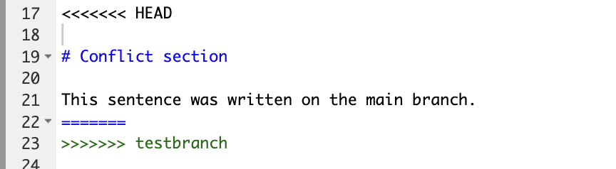
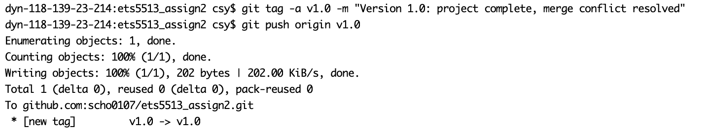
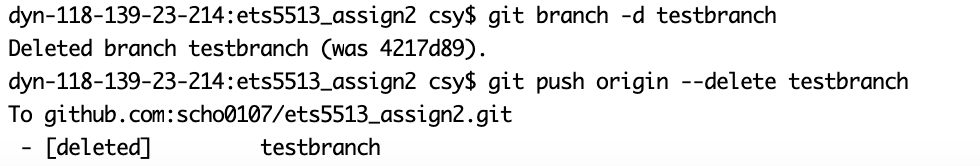

## Step 1: Create Rstudio Project and `example.qmd`

I created a new RStudio Project and named it `etc5513_assign2`. Using an RStudio Project keeps all files organised in one place and ensures file paths are relative to the project folder.

Inside the project I created this file, `example.qmd`, and rendered it to HTML using the **Render** button in RStudio. This confirms the file works properly and can be reproduced.

## Step 2: Initialise Git and Push to GitHub

To start tracking changes, I initialised the project as a Git repository:

``` bash
git init
```

This creates a hidden `.git` folder where git stores all version history. I then staged and committed all files:

``` bash
git add .
git commit -m "create qmd file"
```

`git add .` stages everything in the folder. `git commit` saves a snapshot with a message describing what was included.

Next, I renamed the branch to `main`, connected the repository to GitHub, and pushed:

``` bash
git branch -M main
git remote add origin git@github.com:scho0107/ets5513_assign2.git 
git push -u origin main 
```

`git branch -M main` renames the default branch to `main`. `git remote add origin` links the local repo to GitHub, and `git push -u origin main` uploads the commit and sets up tracking so future pushes work automatically.

## Step 3: Create `testbranch`, Make Changes, and Push

Instead of working directly on `main`, I created a new branch to keep changes isolated:

``` bash
git switch -c testbranch
```

I then edited `example.qmd` by adding a new section. I first ran `git status` to check what had changed, then staged and committed only the intended file:

``` bash
git status
git add example.qmd
git commit -m "Add section on testbranch"
git push -u origin testbranch
```

The push output confirmed that `testbranch` was created on GitHub and set up to track the remote branch.

## Step 4: Add the Data Folder and Amend the Commit

After committing, I added a `data` folder containing the dataset from Assignment 1. I created the folder, copied the CSV file in manually, and then amended the previous commit rather than creating a separate one:

``` bash
mkdir data
git add data
git commit --amend --no-edit
```

`git commit --amend` rewrites the last commit to include the newly staged files. `--no-edit` keeps the original commit message. The output confirmed that `data/33234027_Sum Chong.csv` was included in the amended commit.

Because amending changes the commit hash, a normal push would be rejected, so I used:

``` bash
git push --force-with-lease origin testbranch
```

The terminal confirmed the branch was force updated:

{width="605" height="29"}

## Step 5: Switch to `main` and Create a Conflicting Change

I switched back to `main` and edited `example.qmd` in a different way to what I had done on `testbranch`, so that merging the two branches would produce a conflict:

``` bash
git switch main
git add example.qmd
git commit -m "Edit example file on main"
git push origin main
```

On `testbranch` I had added a section titled "Test branch section", and on `main` I added a section titled "Conflict section" in the same location. This means both branches modified the same part of the file differently, which will cause a conflict when merged.

Here's the section created:

# Test branch section

This section was added on testbranch.

# Conflict section

This sentence was written on the main branch.

## Step 6: Merge `testbranch` into `main` and Resolving the Conflict

I merged the branch:

``` bash
git switch main
git merge testbranch
```

Git detected a conflict and stopped:

{width="547"}

When I opened `example.qmd`, I could see the conflict markers:

{width="479"}

The section under `<<<<<<< HEAD` is what `main` added — the "Conflict section". The `testbranch` side is empty because that section did not exist on `testbranch`. Git flagged this as a conflict because both branches modified the same area of the file differently. I resolved it by keeping the content from `main` and removing the conflict markers, then finalised the merge:

``` bash
git add example.qmd
git commit -m "Resolve merge conflict between main and testbranch"
git push origin main
```

The push output confirmed the merge was successfully uploaded to GitHub.

## Step 7: Tag the Commit as `v1.0`

To mark this stable version of the project, I created an annotated tag:

``` bash
git tag -a v1.0 -m "Version 1.0: project complete, merge conflict resolved"
git push origin v1.0
```

The output confirmed the tag was pushed: `* [new tag] v1.0 -> v1.0`. Annotated tags store extra information such as the date and message, making them more useful than lightweight tags for marking milestones. Tags are not included in a regular `git push`, so I pushed it separately.

Output:



## Step 8: Delete `testbranch` Locally and on the Remote

Since `testbranch` had been merged into `main`, I deleted it from both places:

``` bash
git branch -d testbranch
git push origin --delete testbranch
```

The terminal confirmed: `Deleted branch testbranch (was 4217d89)` and `- [deleted] testbranch`. I used `git branch -d` (lowercase) because it checks the branch has been merged before deleting, which prevents accidental data loss.

Output:



## Step 9: Show commit log

``` bash
git log --oneline
```

```         
f424159 (HEAD -> main, tag: v1.0, origin/main) Resolve merge conflict between main and testbranch
1884339 Edit example file on main
4217d89 Add section on testbranch
f66aff8 create qmd file
```

## Step 10: Add Plot, Commit, and Undo the Commit

``` bash
git add example.qmd
git commit -m "Add simple plot to example file"
git reset --soft HEAD~1
git status
git log --oneline
```

# Test branch section

This section was added on testbranch.

# Conflict section

This sentence was written on the main branch.

#Simple plot

```{r}
plot(mtcars$wt, mtcars$mpg,
     xlab = "Weight",
     ylab = "Miles per gallon",
     main = "Simple plot of mtcars")
```
